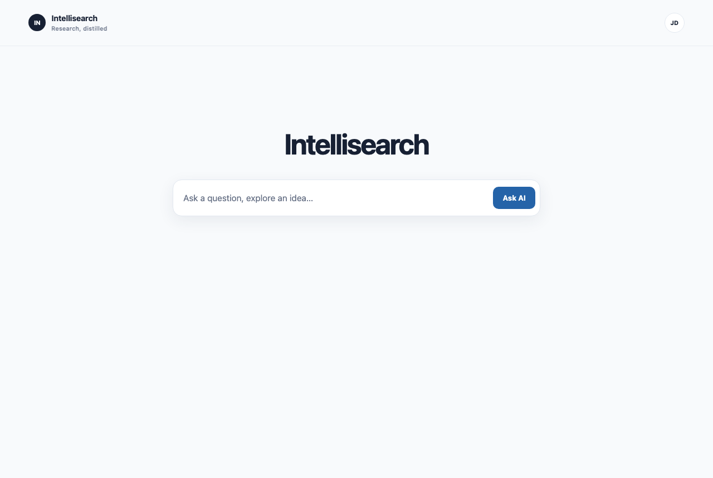
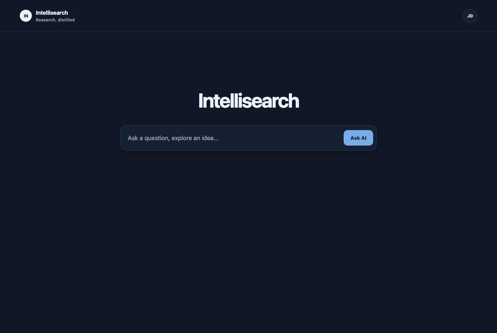
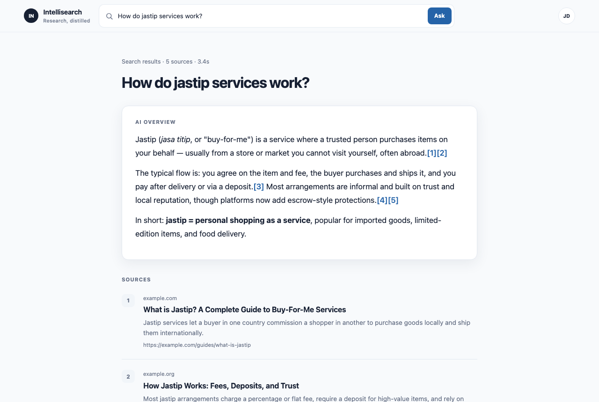
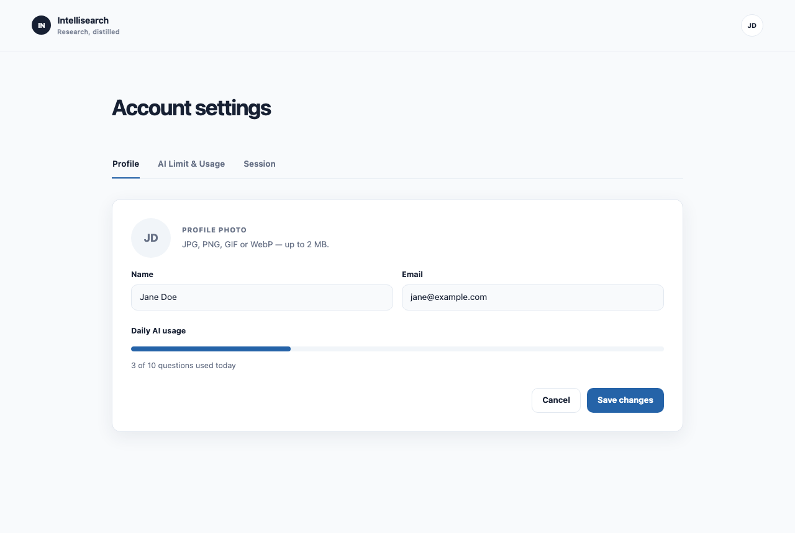
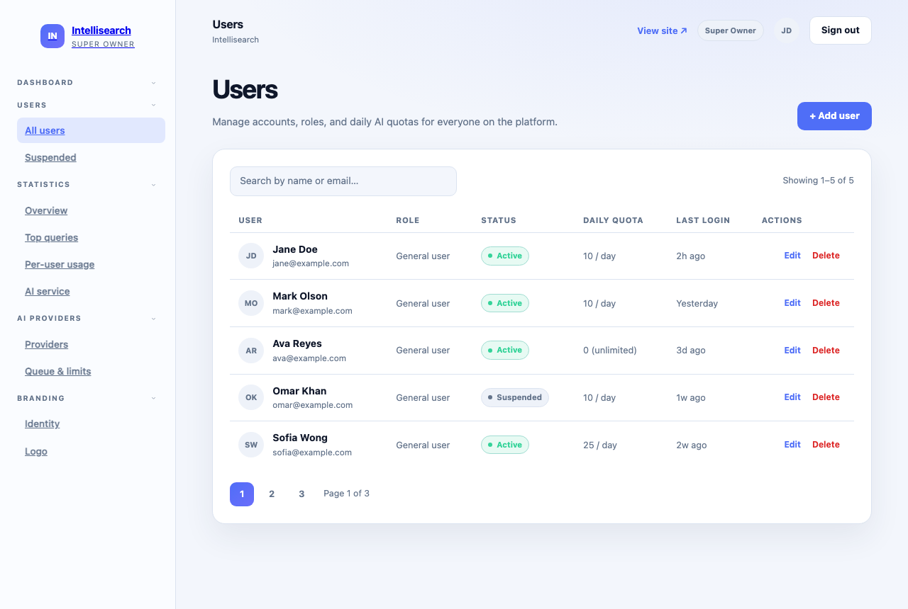

# Intellisearch

A generic, open-source AI main page — as simple as a Google dashboard. Users type a question in a single centered box, press **Ask Me**, and get a combined answer that may draw on live web crawling. The platform is white-label: site name, logo, and tagline are configured per deployment by the Super Owner; the codebase ships with a generic default and no hardcoded branding.

> **Status:** Early MVP implementation. The public UI and backend foundation are in place; AI orchestration and the Owner Control Panel remain in progress. See the [implementation status](docs/tech_stack/IMPLEMENTATION_STATUS.md).

## Documents

- [Product Requirements (PRD index)](docs/PRD/index.md) — product goals, personas, feature specs, mockups, business rules, acceptance criteria
- [Software Design (SDD index)](docs/SDD/index.md) — architecture, tech stack, data models, API design, security implementation
- [Sprint Plan](docs/tech_stack/sprints/MVP_Sprint_Plan.md) — milestone breakdown and delivery plan
- [Implementation Status](docs/tech_stack/IMPLEMENTATION_STATUS.md) — delivered, in-progress, pending, and verified behavior
- [`implementation.md`](implementation.md) — **implementation guide for a developer AI agent**: read this to build the MVP end-to-end
- `AGENTS.md` — working conventions and hard rules for this repo

## Tech Stack

| Layer | Technology |
| --- | --- |
| Frontend | Vue 3, TypeScript, Vite, Vue Router, Pinia (DDD folder structure) |
| Backend | Go, Gin Gonic, GORM, Logrus (Handler → Service → Repository) |
| Database | SQLite (host-run local) or PostgreSQL (Docker/production) + Redis (caching, rate limiting) |
| AI | Ollama (local, privacy-first), OpenAI-compatible providers |
| Search | SearXNG (self-hosted metasearch, JSON API) |
| Crawling | Puppeteer / Playwright (page content) |
| Deployment | Docker + docker-compose |

## Features (MVP)

- **Main page** — Google-like entry point: ask box + "Ask Me" button, chat thread, avatar button
- **Web search & crawler** — AI searches the open web (self-hosted SearXNG) and combines sources into a cited answer; users can submit a URL to crawl (rate-limited)
- **Account settings** — profile, avatar upload, AI usage & daily limit, logout
- **Owner control panel** — user management, usage statistics, AI provider + concurrency/queue settings, branding — all changeable without redeploying

## UI Preview

Design mockups (light & dark themes, responsive from ≥360px):

| Main page (light) | Main page (dark) |
| --- | --- |
|  |  |

| Result page — cited answer + sources | Account settings |
| --- | --- |
|  |  |

| Owner Control Panel — user management |
| --- |
|  |

> Mockups are static previews built from the app's design tokens under `docs/ui-mockups/`; the live UI is served by the frontend dev server (`npm run dev`).

## Getting Started (local)

Requirements: Podman or Docker for Redis, SearXNG, and the Playwright crawler during host-run development; Docker Compose for the full container stack.

```bash
cp .env.example .env   # then edit values as needed
./run-local.sh          # boots SQLite-backed API, Redis, and frontend
```

- Frontend: http://localhost:5173
- API: http://localhost:8088 (health: http://localhost:8088/health)

The API always uses the `{ data, errorCode, errorMessage }` response envelope. Frontend variables use the `VITE_` prefix (see `.env.example`).

## Project Structure

```
backend/     Go API (Gin) — cmd/, internal/{contracts,config,models,repositories,services,handlers,middleware,router}
frontend/    Vue 3 app — src/{views,domains,components,stores,services,styles}
docs/        PRD, SDD, and tech documentation
docker-compose.yml       local development stack
docker-compose.prod.yml  production stack
run-local.sh             local debug (docker compose up)
deploy-prod.sh           production deployment
```

## Deployment (1-touch)

1. Create `.env.production` (gitignored — copy `.env.example` and set strong secrets; the deploy script **refuses** to run with placeholder values).
2. Run:

```bash
./deploy-prod.sh
```

`deploy-prod.sh` validates the production compose config, builds the images, starts the stack, and verifies the API `/health` endpoint reports `ok` before declaring success. It loads `.env.production` (override with `DEPLOY_ENV_FILE=/path/to/env`) and injects it into the API container (`env_file: ["${ENV_FILE:-.env}"]`), so the running stack gets the production secrets — never the dev `.env`.

The stack deploys only its own services (API, frontend, Redis, SearXNG, crawler). PostgreSQL and Ollama are **reused from existing containers**: the API attaches to the external `SHARED_DB_NETWORK` network and connects to the existing DB container by its network alias (`DB_HOST`), and attaches to the external `OLLAMA_NETWORK` (e.g. the Open WebUI network) to reach an existing Ollama by service name. Secrets live only in environment variables / env files and are never committed to the repo.

## License

Released under the [Apache License 2.0](LICENSE.md).
