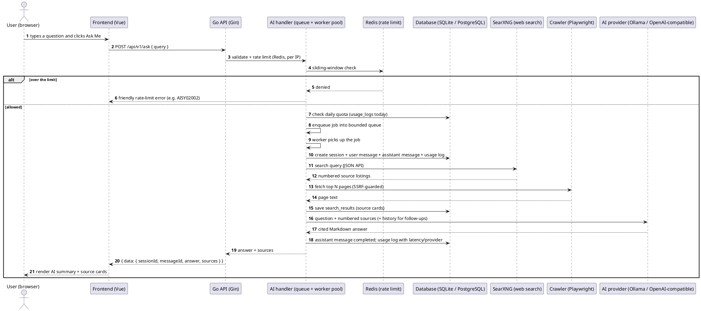

# PRD — Main Page & Ask Flow

> Part of the [PRD index](index.md).

## 3.1 Main Page

A very simple page with Google-like UI and structure. The main use case is AI chat to find anything, including a web crawler — the AI searches the web and combines information from multiple sources.

### UI & Layout

- Centered search/ask box with a single **"Ask Me"** button (Google-like minimalism; no sidebar, no clutter).
- The header shows the configured **site name/logo** (set in the Owner Control Panel); the codebase ships with a generic default.
- **Top-right corner:** an **Account Settings** button showing the user's avatar (Google-style); clicking it opens the user's settings page.
- **Responsive:** mobile-first. On small screens the ask box expands to the available width with comfortable padding, the header stays visible on top, and the chat thread fills the viewport and scrolls natively — no horizontal scrolling at any size.
- **Theming:** light and dark mode with a theme toggle in the header (next to the avatar); the default follows the OS setting.

### Ask Flow (Chat)

- User types a question and clicks **"Ask Me"** (or presses Enter).
- The request is queued and executed by the AI pipeline; the user sees a loading indicator while the answer is generated.
- On submit the user is taken to the **Result Page**, which shows the combined answer, scraped web sources, and a persistent ask box for follow-ups.
- Error handling: friendly error message with retry (e.g., queue full or AI provider down).
- The flow works on mobile: loading/error states stay visible with the keyboard open, and "Ask Me" is reachable without scrolling.

### What happens in the backend when a user searches

> A plain-language walkthrough of the ask flow, from clicking **Ask Me** to the rendered answer. The technical architecture lives in [SDD — System Architecture](../SDD/architecture.md); this section describes the behavior a user (and a non-backend reader) sees.

**In one sentence:** the browser calls a single Go API endpoint; the API validates and rate-limits the request, queues it into a worker pool, searches the web (SearXNG) and reads the best pages (crawler), asks the AI model to synthesize a cited answer, saves everything to the database, and returns the answer plus source cards in a standard response envelope.

**Step by step:**

1. **Submit** — the user types a question and clicks **Ask Me**. The frontend navigates to the Result Page (`/search?q=…`) and sends `POST /api/v1/ask` with the question.
2. **Validate & limit** — the Go API's dedicated **AI handler** checks the question is not empty, applies a Redis sliding-window rate limit (per client IP), and for signed-in users a per-user **daily question quota**. Requests over a limit get a friendly error, never a crash.
3. **Queue & worker** — the request becomes a job in a **bounded queue**; a **worker from the pool** picks it up (concurrency, queue size, and per-request timeout are set by the Super Owner in the control panel and apply without redeploying). Queue overflow returns a friendly "busy, try again" message.
4. **Persist the conversation** — the worker creates a chat session (title = first question), a user message, a pending assistant message, and a usage-log row used for the statistics panel.
5. **Web search** — the search service queries the self-hosted **SearXNG** metasearch engine (backend-to-backend, never from the browser) and maps the results into numbered source cards (title, URL, domain, snippet). If SearXNG is down, the flow continues without web sources instead of failing.
6. **Deep-read the best sources** — the crawler service asks the **Playwright crawler** sidecar to fetch the top pages' full text (top N, configurable, fetched in parallel). Every URL passes an **SSRF guard** first, and each crawl is recorded as a crawl job (blocked URLs are flagged).
7. **Synthesize the answer** — the LLM service sends the question, the numbered sources with their text, and (for follow-ups) the recent conversation history to the **active AI provider** (local Ollama or an OpenAI-compatible API). The model returns a Markdown answer with inline citations like `[1]`.
8. **Save results** — the assistant message is marked completed with the answer; the source cards are stored against it; the usage log is finalized with latency and the provider used.
9. **Respond** — the API returns the standard envelope `{ data: { sessionId, messageId, answer, sources } }`. The Result Page renders the AI summary card and the numbered source list.
10. **Failures** — any step that fails marks the message/usage log as failed and returns a typed error code with a sanitized friendly message (e.g., `AISY02001` queue full, `AISY02002` rate limited, `AISY02003` daily quota reached, `AISY03002` URL blocked).

Follow-ups reuse the same endpoint with the `sessionId` so the conversation continues in the same session; submitting a URL uses `POST /api/v1/ask/url`, which skips search and crawls that one page (much stricter rate limit: 5/hour).

**Sequence diagram (PlantUML):** renders on [plantuml.com](https://www.plantuml.com/plantuml) or with a PlantUML IDE/editor plugin.



**The backend pieces involved:**

| Piece | Role in the ask flow |
| --- | --- |
| **AI handler** | The only entry point for AI work; owns the queue + worker pool and the runtime metrics shown on the AI-stats page |
| **Redis** | Sliding-window rate limiting (per IP; URL submissions capped at 5/hour) |
| **Database** | Chat sessions, messages, `search_results` source cards, `usage_logs`, `crawl_jobs`, providers, queue config, site settings |
| **SearXNG** | Self-hosted metasearch returning source listings; called backend-to-backend only |
| **Crawler (Playwright)** | Fetches full page text for deep reading; SSRF-guarded; every attempt recorded as a crawl job |
| **AI provider** | Local Ollama or an OpenAI-compatible API; API keys encrypted at rest, decrypted only at call time |

### Web Search & Crawler

- The AI searches the open web and combines information from multiple sources into a single answer.
- Search listings come from a self-hosted **SearXNG** metasearch engine (container on the same server, called backend-to-backend). The crawler fetches page content for deeper reading.
- Users may submit a specific URL to crawl.
- **Abuse protection:** the URL-submission feature is rate limited.

## Mockup (desktop)

```
┌──────────────────────────────────────────────────────────┐
│                                                  (avatar)│
│                                                          │
│                    [Site Name]                           │
│                                                          │
│        ┌────────────────────────────────────┐            │
│        │ Ask anything...                    │            │
│        └────────────────────────────────────┘            │
│                        [ Ask Me ]                        │
│                                                          │
└──────────────────────────────────────────────────────────┘
```

On mobile the ask box expands to the available width (with comfortable padding); the header and "Ask Me" button stay visible. Clicking **Ask Me** navigates to the Result Page.
